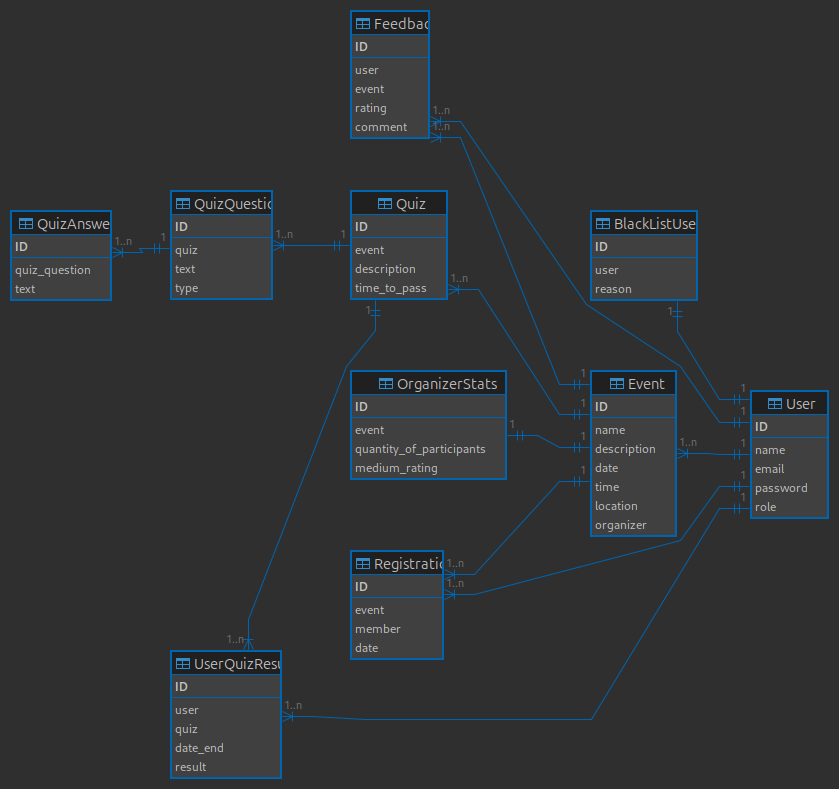
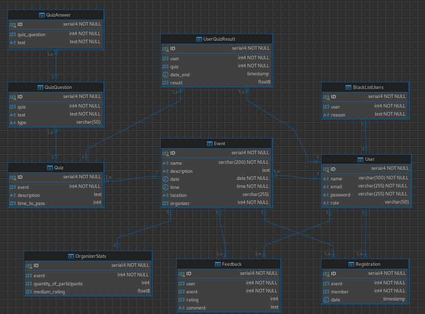
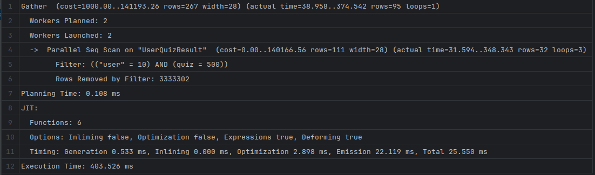
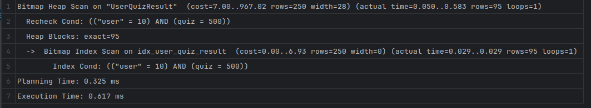

# ER диграмма


# Даталогическая модель


# Скрипты
## Создание таблиц БД
```pgsql
CREATE TABLE "User"
(
    "ID"       SERIAL PRIMARY KEY,
    "name"     VARCHAR(100)        NOT NULL,
    "email"    VARCHAR(255) UNIQUE NOT NULL,
    "password" VARCHAR(255)        NOT NULL,
    "role"     VARCHAR(50) CHECK ("role" IN ('organizer', 'participant', 'admin'))
);

CREATE TABLE "Event"
(
    "ID"          SERIAL PRIMARY KEY,
    "name"        VARCHAR(200) NOT NULL,
    "description" TEXT,
    "date"        DATE         NOT NULL,
    "time"        TIME         NOT NULL,
    "location"    VARCHAR(255),
    "organizer"   INT          NOT NULL,
    CONSTRAINT "FK_Event_Organizer"
        FOREIGN KEY ("organizer") REFERENCES "User" ("ID") ON DELETE CASCADE
);

CREATE TABLE "Registration"
(
    "ID"     SERIAL PRIMARY KEY,
    "event"  INT NOT NULL,
    "member" INT NOT NULL,
    "date"   TIMESTAMP DEFAULT CURRENT_TIMESTAMP,
    CONSTRAINT "FK_Registration_Event"
        FOREIGN KEY ("event") REFERENCES "Event" ("ID") ON DELETE CASCADE,
    CONSTRAINT "FK_Registration_User"
        FOREIGN KEY ("member") REFERENCES "User" ("ID") ON DELETE CASCADE
);

CREATE TABLE "Quiz"
(
    "ID"           SERIAL PRIMARY KEY,
    "event"        INT NOT NULL,
    "description"  TEXT,
    "time_to_pass" INT CHECK ("time_to_pass" > 0),
    CONSTRAINT "FK_Quiz_Event"
        FOREIGN KEY ("event") REFERENCES "Event" ("ID") ON DELETE CASCADE
);

CREATE TABLE "QuizQuestion"
(
    "ID"   SERIAL PRIMARY KEY,
    "quiz" INT  NOT NULL,
    "text" TEXT NOT NULL,
    "type" VARCHAR(50) CHECK ("type" IN ('text', 'multiple_choice', 'single_choice')),
    CONSTRAINT "FK_QuizQuestion_Quiz"
        FOREIGN KEY ("quiz") REFERENCES "Quiz" ("ID") ON DELETE CASCADE
);

CREATE TABLE "QuizAnswer"
(
    "ID"            SERIAL PRIMARY KEY,
    "quiz_question" INT  NOT NULL,
    "text"          TEXT NOT NULL,
    CONSTRAINT "FK_QuizAnswer_QuizQuestion"
        FOREIGN KEY ("quiz_question") REFERENCES "QuizQuestion" ("ID") ON DELETE CASCADE
);

CREATE TABLE "UserQuizResult"
(
    "ID"       SERIAL PRIMARY KEY,
    "user"     INT NOT NULL,
    "quiz"     INT NOT NULL,
    "date_end" TIMESTAMP DEFAULT CURRENT_TIMESTAMP,
    "result"   FLOAT CHECK ("result" >= 0 AND "result" <= 100),
    CONSTRAINT "FK_UserQuizResult_User"
        FOREIGN KEY ("user") REFERENCES "User" ("ID") ON DELETE CASCADE,
    CONSTRAINT "FK_UserQuizResult_Quiz"
        FOREIGN KEY ("quiz") REFERENCES "Quiz" ("ID") ON DELETE CASCADE
);

CREATE TABLE "Feedback"
(
    "ID"      SERIAL PRIMARY KEY,
    "user"    INT NOT NULL,
    "event"   INT NOT NULL,
    "rating"  INT CHECK ("rating" BETWEEN 1 AND 5),
    "comment" TEXT,
    CONSTRAINT "FK_Feedback_User"
        FOREIGN KEY ("user") REFERENCES "User" ("ID") ON DELETE CASCADE,
    CONSTRAINT "FK_Feedback_Event"
        FOREIGN KEY ("event") REFERENCES "Event" ("ID") ON DELETE CASCADE
);

CREATE TABLE "OrganizerStats"
(
    "ID"                       SERIAL PRIMARY KEY,
    "event"                    INT NOT NULL UNIQUE,
    "quantity_of_participants" INT CHECK ("quantity_of_participants" >= 0),
    "medium_rating"            FLOAT CHECK ("medium_rating" >= 0 AND "medium_rating" <= 5),
    CONSTRAINT "FK_OrganizerStats_Event"
        FOREIGN KEY ("event") REFERENCES "Event" ("ID") ON DELETE CASCADE
);

CREATE TABLE "BlackListUsers"
(
    "ID"     SERIAL PRIMARY KEY,
    "user"   INT  NOT NULL UNIQUE,
    "reason" TEXT NOT NULL,
    CONSTRAINT "FK_BlackListUsers_User"
        FOREIGN KEY ("user") REFERENCES "User" ("ID") ON DELETE CASCADE
);
```

## Заполнение тестовыми данными
```pgsql
INSERT INTO "User" ("name", "email", "password", "role")
VALUES ('Alice Smith', 'alice.smith@example.com', 'password123', 'organizer'),
       ('Bob Johnson', 'bob.johnson@example.com', 'securepass', 'participant'),
       ('Charlie Brown', 'charlie.brown@example.com', 'charlie123', 'participant'),
       ('Admin User', 'admin@example.com', 'adminpass', 'admin');

INSERT INTO "Event" ("name", "description", "date", "time", "location", "organizer")
VALUES ('Tech Conference 2024', 'A conference for tech enthusiasts', '2024-05-15', '10:00', 'Tech Park', 1),
       ('Music Festival', 'Enjoy live music performances', '2024-06-20', '18:00', 'City Stadium', 1);

INSERT INTO "Registration" ("event", "member")
VALUES (1, 2),
       (1, 3),
       (2, 2);

INSERT INTO "Quiz" ("event", "description", "time_to_pass")
VALUES (1, 'Tech Trivia Quiz', 30),
       (2, 'Music Knowledge Quiz', 20);

INSERT INTO "QuizQuestion" ("quiz", "text", "type")
VALUES (1, 'What is the capital of Silicon Valley?', 'text'),
       (1, 'Choose the top programming languages:', 'multiple_choice'),
       (2, 'Who is known as the King of Pop?', 'text');

INSERT INTO "QuizAnswer" ("quiz_question", "text")
VALUES (2, 'Python'),
       (2, 'JavaScript'),
       (2, 'C++'),
       (3, 'Michael Jackson');

INSERT INTO "UserQuizResult" ("user", "quiz", "result")
VALUES (2, 1, 80.0),
       (3, 1, 90.0),
       (2, 2, 70.0);

INSERT INTO "Feedback" ("user", "event", "rating", "comment")
VALUES (2, 1, 5, 'Great event, very informative!'),
       (3, 1, 4, 'Good event but could improve timing.');

INSERT INTO "OrganizerStats" ("event", "quantity_of_participants", "medium_rating")
VALUES (1, 2, 4.5),
       (2, 1, 0.0);

INSERT INTO "BlackListUsers" ("user", "reason")
VALUES (3, 'Spamming during the event.');
```


## Удаление таблиц БД
```pgsql
DROP TABLE IF EXISTS "BlackListUsers" CASCADE;
DROP TABLE IF EXISTS "OrganizerStats" CASCADE;
DROP TABLE IF EXISTS "Feedback" CASCADE;
DROP TABLE IF EXISTS "UserQuizResult" CASCADE;
DROP TABLE IF EXISTS "QuizAnswer" CASCADE;
DROP TABLE IF EXISTS "QuizQuestion" CASCADE;
DROP TABLE IF EXISTS "Quiz" CASCADE;
DROP TABLE IF EXISTS "Registration" CASCADE;
DROP TABLE IF EXISTS "Event" CASCADE;
DROP TABLE IF EXISTS "User" CASCADE;
```

---

## Триггеры
### Автоматическое обновление статистики организаторов
```pgsql
CREATE OR REPLACE FUNCTION update_participants_count()
RETURNS TRIGGER AS $$
BEGIN
  UPDATE "OrganizerStats"
  SET "quantity_of_participants" = "quantity_of_participants" + 1
  WHERE "event" = NEW."event";
  RETURN NEW;
END;
$$ LANGUAGE plpgsql;

CREATE TRIGGER increment_participants
AFTER INSERT ON "Registration"
FOR EACH ROW
EXECUTE FUNCTION update_participants_count();
```

### Автоматический пересчёт среднего рейтинга
```pgsql
CREATE OR REPLACE FUNCTION update_medium_rating()
RETURNS TRIGGER AS $$
BEGIN
  UPDATE "OrganizerStats"
  SET "medium_rating" = (
    SELECT AVG("rating")::FLOAT
    FROM "Feedback"
    WHERE "event" = NEW."event"
  )
  WHERE "event" = NEW."event";
  RETURN NEW;
END;
$$ LANGUAGE plpgsql;

CREATE TRIGGER recalculate_rating
AFTER INSERT OR UPDATE ON "Feedback"
FOR EACH ROW
EXECUTE FUNCTION update_medium_rating();
```

---

## pl/pgsql-функции и процедуры для прецедентов

### Функция для регистрации нового пользователя
```pgsql
CREATE OR REPLACE FUNCTION register_user(user_name TEXT, user_email TEXT, user_password TEXT) 
RETURNS TEXT AS $$
DECLARE
    user_exists BOOLEAN;
BEGIN
    SELECT EXISTS (SELECT 1 FROM "User" WHERE "email" = user_email) INTO user_exists;
    
    IF user_exists THEN
        RETURN 'Пользователь с таким email уже существует. Пожалуйста, войдите в систему.';
    ELSE
        INSERT INTO "User" ("name", "email", "password", "role") 
        VALUES (user_name, user_email, user_password, 'participant');
        RETURN 'Регистрация успешна! Проверьте вашу почту для подтверждения.';
    END IF;
END;
$$ LANGUAGE plpgsql;
```

### Функция для создания нового мероприятия
```pgsql
CREATE OR REPLACE FUNCTION create_event(
    event_name TEXT, 
    event_description TEXT, 
    event_date DATE, 
    event_time TIME, 
    event_location TEXT, 
    organizer_id INT,
    quiz_description TEXT DEFAULT NULL,
    quiz_time_to_pass INT DEFAULT NULL
) RETURNS TEXT AS $$
DECLARE
    event_id INT;
BEGIN
    IF NOT EXISTS (SELECT 1 FROM "User" WHERE "id" = organizer_id AND "role" = 'organizer') THEN
        RETURN 'Ошибка: Только авторизованные организаторы могут создавать мероприятия.';
    END IF;

    INSERT INTO "Event" ("name", "description", "date", "time", "location", "organizer") 
    VALUES (event_name, event_description, event_date, event_time, event_location, organizer_id)
    RETURNING "id" INTO event_id;

    RETURN 'Мероприятие успешно создано.';
END;
$$ LANGUAGE plpgsql;
```

### Процедура для регистрации пользователя на мероприятие:
```pgsql
CREATE OR REPLACE FUNCTION register_for_event(event_id INT, user_id INT) 
RETURNS TEXT AS $$
DECLARE
    is_full BOOLEAN;
    already_registered BOOLEAN;
BEGIN

    SELECT EXISTS (SELECT 1 FROM "Registration" WHERE "event" = event_id AND "member" = user_id) INTO already_registered;

    IF already_registered THEN
        RETURN 'Вы уже зарегистрированы на это мероприятие.';
    END IF;

    INSERT INTO "Registration" ("event", "member") VALUES (event_id, user_id);
    RETURN 'Вы успешно зарегистрировались на мероприятие.';
END;
$$ LANGUAGE plpgsql;
```

### Процедура для сохранения результата прохождения квиза
```pgsql
CREATE OR REPLACE FUNCTION save_quiz_result(user_id INT, quiz_id INT, result FLOAT) 
RETURNS TEXT AS $$
BEGIN
    -- Проверяем, зарегистрировался ли пользователь на меро
    IF NOT EXISTS (SELECT 1 FROM "Registration" r JOIN "Event" e ON r."event" = e."id"
                   WHERE r."member" = user_id AND e."id" = (SELECT "event" FROM "Quiz" WHERE "id" = quiz_id)) THEN
        RETURN 'Ошибка: Вы не зарегистрированы на это мероприятие.';
    END IF;

    INSERT INTO "UserQuizResult" ("user", "quiz", "result") 
    VALUES (user_id, quiz_id, result)
    ON CONFLICT ("user", "quiz") DO UPDATE 
    SET "result" = EXCLUDED."result";

    RETURN 'Результат квиза успешно сохранён.';
END;
$$ LANGUAGE plpgsql;
```

### Функция для добавления отзыва
```pgsql
CREATE OR REPLACE FUNCTION leave_feedback(user_id INT, event_id INT, rating INT, comment TEXT) 
RETURNS TEXT AS $$
BEGIN
    IF NOT EXISTS (SELECT 1 FROM "Registration" WHERE "event" = event_id AND "member" = user_id) THEN
        RETURN 'Ошибка: Вы не участвовали в этом мероприятии.';
    END IF;

    INSERT INTO "Feedback" ("user", "event", "rating", "comment") 
    VALUES (user_id, event_id, rating, comment);
    
    RETURN 'Отзыв успешно добавлен.';
END;
$$ LANGUAGE plpgsql;
```

## Индекс
Прецедент: Участие в квизе
```pgsql
CREATE INDEX idx_user_quiz_result ON "UserQuizResult" ("user", "quiz");
```

### Обоснование использования индекса
[Скрипт для тестирования](test_index.sql)

Без индекса


С индексом

